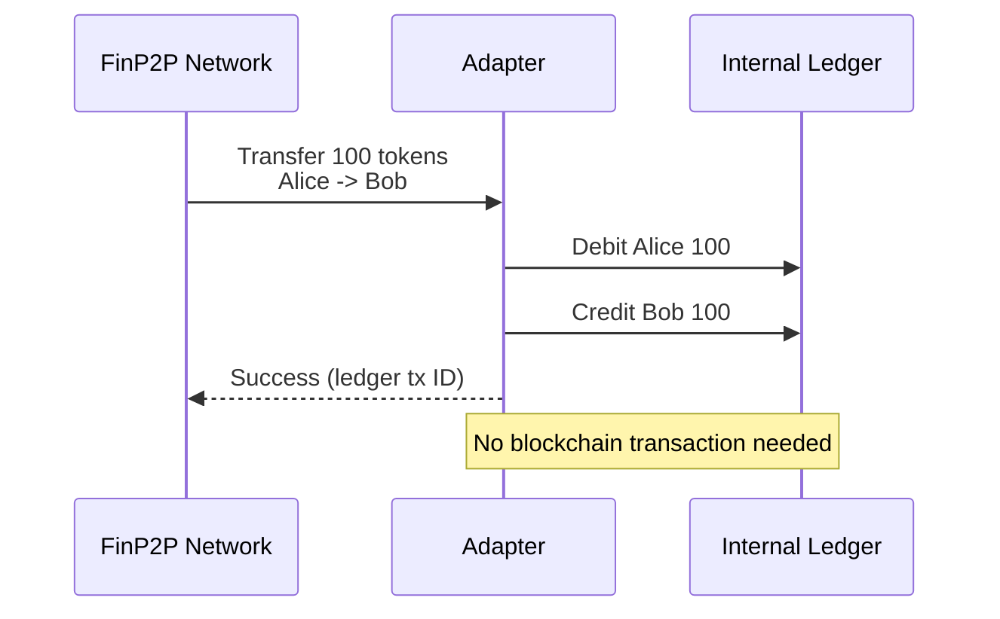
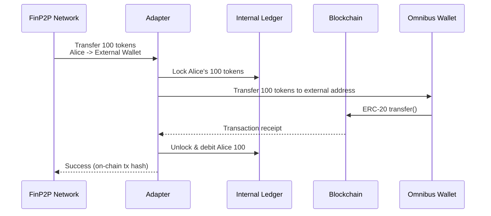
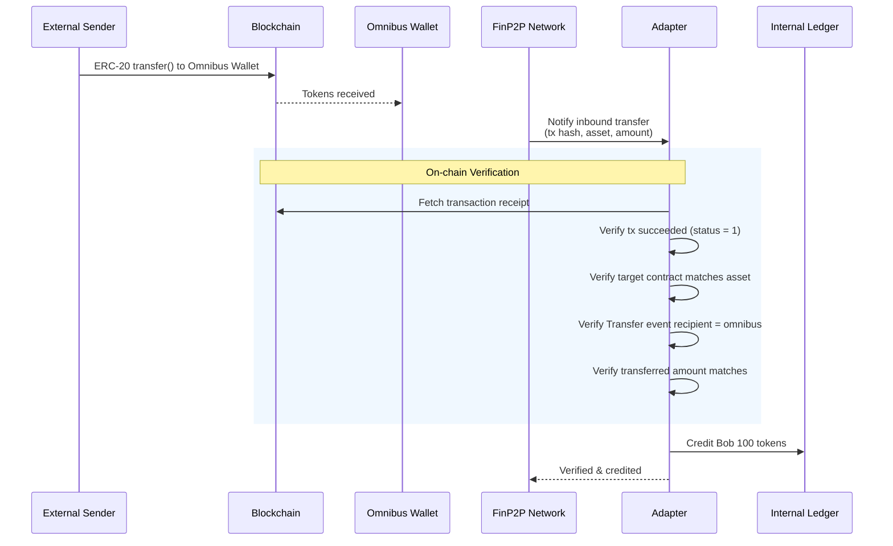
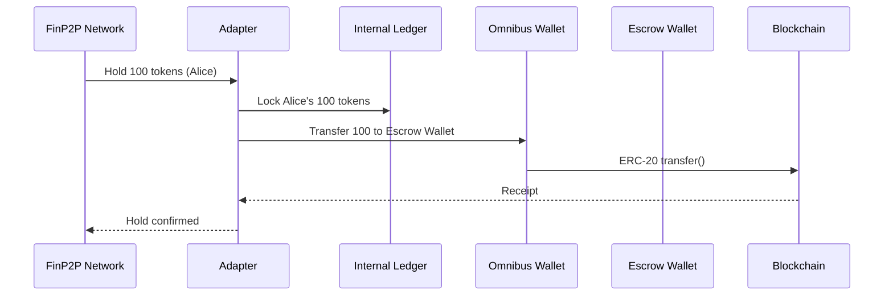
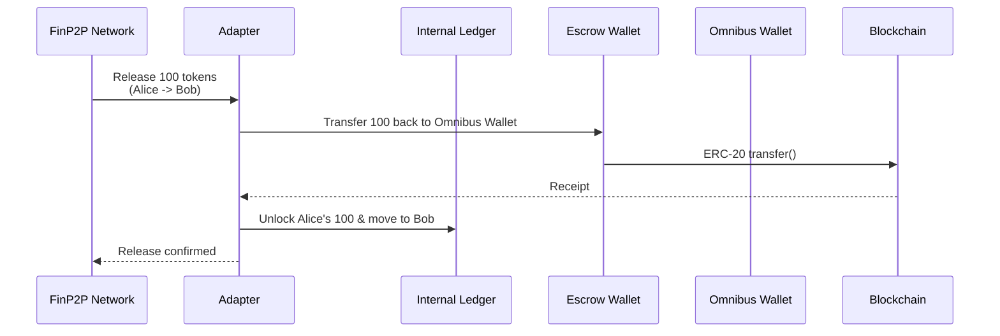
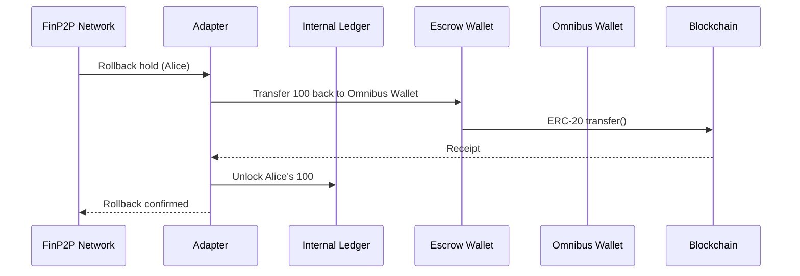
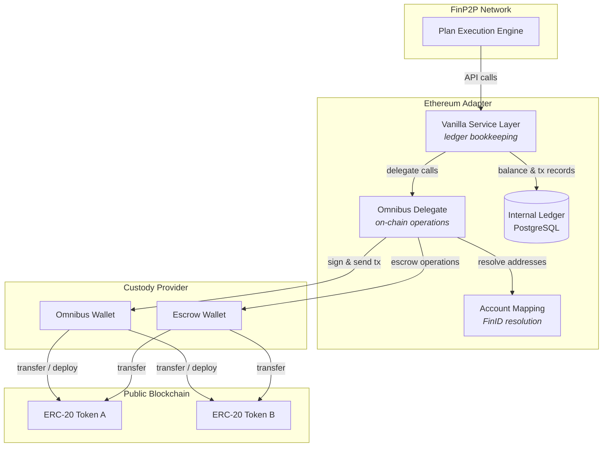

# Omnibus Account Model

## Overview

The Ethereum adapter supports two account models for managing digital assets on public blockchains:

- **Segregated** (default) -- each investor has their own on-chain wallet managed by a custodian. Transfers happen directly between individual wallets.
- **Omnibus** -- all investor balances are pooled into a single custodial wallet. The adapter maintains an internal ledger that tracks individual ownership, while all on-chain activity flows through one shared wallet.

Omnibus is the standard model used by traditional custodians and brokerages. It simplifies on-chain operations, reduces gas costs, and aligns with how most regulated institutions hold assets on behalf of their clients.

---

## Key Concepts

### The Omnibus Wallet

A single blockchain wallet controlled by the custodian that holds pooled assets on behalf of all investors. Individual investors don't have their own on-chain wallets -- their balances exist only in the adapter's internal ledger.

### Internal Ledger

A database-backed record of who owns what. Every issuance, transfer, hold, and redemption is recorded as a ledger transaction. The ledger enforces balance constraints (no overdrafts, no releasing unheld funds) and provides idempotent operations.

### Escrow Wallet

A separate custodial wallet used to temporarily hold assets during multi-step settlement workflows (e.g., delivery-vs-payment). Funds move from the omnibus wallet to escrow during a hold, and back upon release or rollback.

### Account Mapping

Since investors don't have individual on-chain wallets in omnibus mode, the adapter needs a way to resolve investor identities (FinIDs) to blockchain addresses when interacting with external parties. Two strategies are supported:

- **Derivation** -- deterministically derives an Ethereum address from the investor's public key (FinID). No database required.
- **Database** -- stores explicit FinID-to-address mappings in a database table. Supports one-to-many relationships.

---

## How It Works

### Internal Transfers (investor to investor)

When both parties are within the same organization, no on-chain transaction is needed. The ledger simply debits the sender and credits the receiver.

### Outbound Transfers (sending to an external party)

When an investor sends assets to an external destination (another organization's wallet), the adapter locks funds in the ledger, executes the on-chain transfer from the omnibus wallet, and then finalizes the debit.

If the on-chain transfer fails, the lock is released and Alice's balance is restored.

### Inbound Transfers (receiving from an external party)

When an external party sends tokens to the omnibus wallet, the adapter verifies the transaction on-chain before crediting the recipient in the internal ledger.

The verification includes polling the blockchain for the receipt (up to 5 seconds) to handle propagation delays.

### Escrow: Hold, Release, and Rollback

Escrow operations support delivery-vs-payment (DvP) and other conditional settlement patterns. The flow involves both the internal ledger and actual on-chain movements between the omnibus and escrow wallets.

#### Hold

#### Release (settlement succeeds)

#### Rollback (settlement cancelled)

### Asset Creation

New assets can be created in two ways:

1. **Deploy a new token** -- the adapter deploys a fresh ERC-20 smart contract from the omnibus wallet and registers it with the custodian.
2. **Bind an existing token** -- the adapter references an already-deployed token contract by its address.

In both cases, the asset is recorded in the adapter's database for future lookups.

---

## Architecture

### Layer Responsibilities

| Layer | Role |
|---|---|
| **Vanilla Service** | Manages the internal ledger. Handles balance accounting, idempotency, and orchestrates the lock-execute-settle pattern for external operations. |
| **Omnibus Delegate** | Executes actual blockchain transactions. Sends tokens from the omnibus or escrow wallet, verifies inbound transfers on-chain, and deploys new token contracts. |
| **Account Mapping** | Resolves investor identities to blockchain addresses for outbound transfers to external parties. |
| **Custody Provider** | Abstracts wallet management. Handles key storage and transaction signing through Fireblocks, Dfns, or other custodians. |

---

## Configuration

### Enabling Omnibus Mode

Set the account model to `omnibus` and provide the omnibus wallet identifier for your custody provider:

| Variable | Description |
|---|---|
| `ACCOUNT_MODEL` | Set to `omnibus` (default: `segregated`) |
| `PROVIDER_TYPE` | Custody provider: `fireblocks` or `dfns` |
| `FIREBLOCKS_OMNIBUS_VAULT_ID` | Fireblocks vault ID for the omnibus wallet |
| `DFNS_OMNIBUS_WALLET_ID` | Dfns wallet ID for the omnibus wallet |
| `ACCOUNT_MAPPING_TYPE` | `derivation` (default) or `database` |

The omnibus wallet uses the same custody credentials and blockchain network as the issuer and escrow wallets -- only the wallet/vault identifier differs.

A PostgreSQL database is required for the internal ledger. The connection is configured through the skeleton adapter's standard storage settings.

### Custody Wallets Summary

| Wallet | Purpose | Required in Omnibus |
|---|---|---|
| **Issuer** | Deploys token contracts (segregated mode) | Configured but unused by omnibus operations |
| **Escrow** | Temporary hold during settlement | Yes |
| **Omnibus** | Pooled asset custody for all investors | Yes |

---

## Segregated vs. Omnibus Comparison

| Aspect | Segregated | Omnibus |
|---|---|---|
| **On-chain wallets** | One per investor | One shared wallet |
| **Balance tracking** | On-chain (per-wallet balances) | Internal ledger (database) |
| **Internal transfers** | On-chain transaction required | Ledger update only (no gas cost) |
| **External transfers** | Direct wallet-to-wallet | Omnibus wallet sends/receives |
| **Escrow** | On-chain hold per investor | Omnibus-to-escrow transfer |
| **Gas costs** | Higher (more wallets, more txs) | Lower (single wallet, fewer txs) |
| **Privacy** | Investor addresses visible on-chain | Individual balances hidden on-chain |
| **Custodian complexity** | Manage many wallets | Manage few wallets + ledger DB |
| **Inbound verification** | Not applicable | On-chain receipt verification |

---

## Inbound Transfer Verification

When the adapter receives notification of an inbound transfer, it performs rigorous on-chain verification before crediting the recipient's ledger balance:

1. **Transaction exists** -- polls the blockchain for the transaction receipt (configurable timeout, default 5 seconds)
2. **Transaction succeeded** -- checks that the transaction status is successful
3. **Correct asset** -- verifies the transaction targeted the expected ERC-20 token contract
4. **Correct recipient** -- confirms the ERC-20 Transfer event has the omnibus wallet as the receiver
5. **Correct amount** -- compares the on-chain transferred amount against the expected value, accounting for token decimals

If any check fails, the credit is rejected and the FinP2P network is notified of the verification failure.
